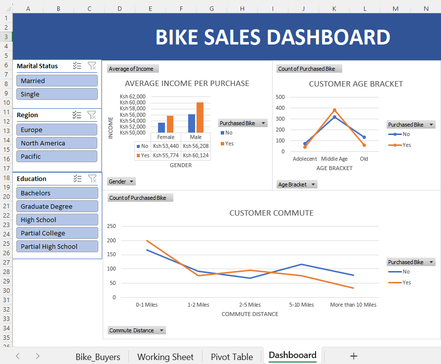

# 🚴 Bike Sales Dashboard (Excel Project)

## 📌 Overview
This project analyzes bike purchase behavior using an interactive Excel dashboard built with pivot tables and slicers.

## 📊 Features
- Dynamic filtering using slicers (Marital Status, Region, Education)
- Income analysis by gender
- Customer segmentation by age group
- Commute distance vs purchase trends

## 🛠 Tools Used
- Microsoft Excel  
- Pivot Tables  
- Data Visualization  
- Slicers  

## 📷 Dashboard Preview

## 📁 Dataset
The dataset includes customer demographics, income, and purchase behavior.

## 🔍 Key Insights
- Higher income customers are more likely to purchase bikes  
- Middle-aged individuals have the highest purchase rate  
- Customers with shorter commute distances tend to buy more bikes  

## 📁 Files Included
- `Bike_Sales_Dashboard.xlsx` → Main dashboard file
- `dashboard.png` → Dashboard preview image
